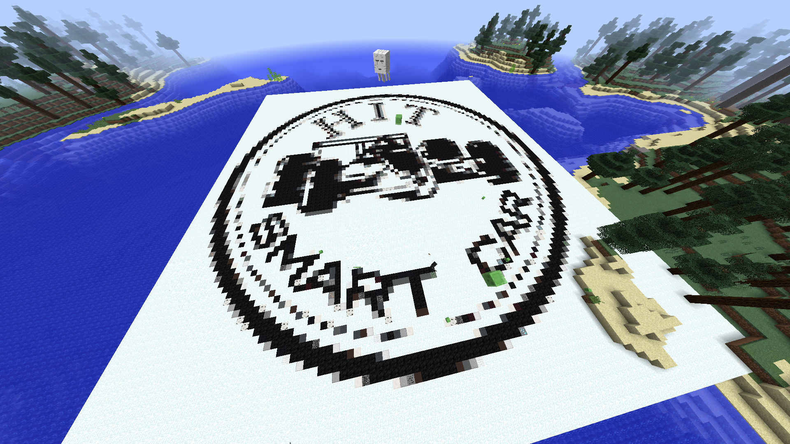
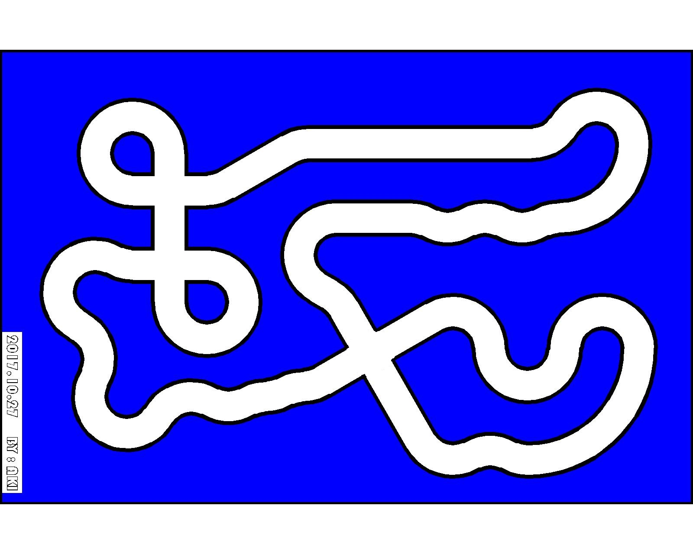

VisionSimulator
===============
A virtue platform to run image processing simulation for smartcar race.
智能车仿真图像生成平台。

-   Group:哈尔滨工业大学

-   Maintain:fuqingxu

-   Contact:qq_505030475




 #### 测试环境：

-      windows 10 最新
-      visual studio 2017
-      平台工具集vc14
-      vs 集成 nuget 以及 nuget 平台获取的 opencv.win.native
-      Minecraft 1.12.2 （见2.1节第一条）


#### 更新

此次更新很多


先可以处理图片文件

现在可以使用 + -和 * 按键保存图像到任意选定位置

上传了一个示例地图：

<center></center>

### 零、效果演示

-   点击 [这里](http://v.youku.com/v_show/id_XMzg4NTgwMTc0NA==.html?spm=a2hzp.8244740.0.0 "Title") 查看

-   或者点击链接 http://v.youku.com/v_show/id_XMzg4NTgwMTc0NA==.html?spm=a2hzp.8244740.0.0

### 一、工程依赖：

-   vc14工具集

-   opencv.win.native nuget包

-   打开工程下图选择“无升级”
<center></center>


### 二、基于minecraft的图像虚拟平台

#### 2.1 Minecraft

建议使用版本1.12.2，建议下载方式：

-   Java版本：我的世界中文下载站（不过请支持正版\~）

-   网易mc中国版（免费正版）

-   Windows应用商店版本（付费）

安装后，打开我提供的example世界。如何制作世界请自行参考其他资料。
<div style="align: center">


</div>

1.  使用独立显卡运行游戏！

2.  F1键隐藏手

3.  /gamemode 1 开启创造模式便于调整视角

4.  F3+P快捷键：是一个可以取消切出游戏换面时弹出的ESC游戏选项的功能，也就是说切出游戏不需要打开背包或者打开对话窗即可直接切出，单机玩家不会进入暂停界面。

5.  视频设置渲染距离远

6.  角视场自行调整

7.  双击空格离地

8.  空格上升

9.  shift下降。

10. /gamerule doMobSpawning false禁止生物出现

11. /weather rain 雪花噪点

12. F3查看当前坐标：所处高度，摄像头指向等

13. 锁定时间请自行查找命令

14. 地图制作：使用AUTOCAD导出图片，然后SpritecraftFull将图片转schematic，最后使用mcedit制作地图，相关工具恕不能上传。

15. 为了严格保持视角的俯仰角不变化，建议开启Windows的“鼠标键”功能，即使用数字键4,6,2,8来控制鼠标简介控制视角的水平转动。

#### 2.2 VisionSimulator

##### 2.2.1 注意事项

使用Visual Studio 2017或Visual Studio
2015,为保证程序能够正确编译，请配置平台工具集为Visual Studio 2015（v140）。

<div style="align: center">

</div>


否则nuget获得的opencv会出问题。

##### 2.2.2 开始

编译运行，程序检测所有windows窗体，选择其中的Minecraft窗体，如图：

<div style="align: center">

</div>

##### 2.2.3 运行

将游戏界面拖到你能看到的位置，此时程序将会实时捕获游戏界面。

<div style="align: center">

</div>

##### 2.2.4 裁剪

如果捕获的画面包含有标题栏等不希望出现的东西，按控制台上的提示按按键调整。

##### 2.2.5边界柔和以及二值化

使用下面的代码进行边界柔和以及二值化。
```
	cvtColor(src_orig, src_gray, CV_BGR2GRAY);//灰度化
	//(弃用)Mat src_cut = src_gray(Range(up_cut, src_gray.rows - 1 - down_cut), Range(left_cut, src_gray.cols - 1 - right_cut));//裁剪
	src_cut = src_gray;

	/*计算高斯滤波核大小*///模糊图像以取得顺滑的边界线
	int kenel_size_x = 4 * src_cut.rows / _target_hight; if (kenel_size_x % 2 == 0) kenel_size_x += 1;
	int kenel_size_y = 4 * src_cut.cols / _target_width; if (kenel_size_y % 2 == 0) kenel_size_y += 1;
	int kenel = (kenel_size_x > kenel_size_y) ? kenel_size_x : kenel_size_y;//取较大的当卷积核

	GaussianBlur(src_cut, src_blur, Size(kenel, kenel), blur_parameter);

	threshold(src_blur, img_threshold, 0, 255, CV_THRESH_OTSU);//大津法二值化
	Size size(_target_width, _target_hight);
	resize(img_threshold, target_img, size, NULL, NULL, INTER_AREA);
	threshold(target_img, target_img, 125, 255, CV_THRESH_BINARY);

	cvtColor(target_img, img_result, cv::COLOR_GRAY2BGR);//复制图像


	return target_img;
	//target_img is the result
```
##### 2.2.6 图像处理接口

-   三个文件负责处理图像：


-   测试的图像处理函数的内容
```
//下面几个头文件使得该文件（imageprocess）可以跨越单片机和电脑，复制粘贴后即可运行在单片机上

//请在单片机和电脑上编写不同的"environment.h"和"extVarContainer.h"

\#include \<stdint.h\>

\#include "environment.h" //指示了当前的环境

\#include "extVarContainer.h" //存放了单片机上一些不能转移的外部变量，例如extern
float speed;访问虚拟的车速

int imageProcessOnChipAndOnVS(uint8_t (\*img)[CAMERA_COLS])

{

     for (int i = 10; i \< CAMERA_ROWS - 10; i++)//测试：在图像中画一条竖线

     {

           for (int j = 10; j \< CAMERA_COLS - 10; j++)

           {

                 if (j == 40)

                 {

                     img[i][j] = 125;

                 }

           }

     }

     return 0;

}
```
-   主程序中的图像处理函数接口：
```
	while (true)/*********************开始办正事**********************/
	{
     src_orig = hwnd2mat(hq);/*游戏画面获取*/
     if (!(src_orig.rows > 0 && src_orig.rows > 0)) continue;/*图像异常，终止*/
     target_img = preprocess_image(src_orig);/*灰度化、裁剪、模糊、二值化、改变大小*/
     /********************************************************************/
     //showing_result_already_handled是个标志位
     //在imageProcessOnChipAndOnVS中调用绘制img_result后，将避免再次绘制
     /********************************************************************/
     Mat2ChipImg(target_img);///////////////////////////////////////////**/
     showing_result_already_handled = false;////////////////////////////**/
     ///////////////////////////////////////////////////////////////////**/
     //////////////////////图像处理程序在此/////////////////////////////**/
     ///////////////////////////////////////////////////////////////////**/
     ///////////////////////////////////////////////////////////////////**/
     imageProcessOnChipAndOnVS(image_OnChip);///////////////////////////**/
     ///////////////////////////////////////////////////////////////////**/
     ///////////////////////////////////////////////////////////////////**/
     ///////////////////////////////////////////////////////////////////**/
     if (!showing_result_already_handled) ChipImg2Mat();////////////////**/
     ///////////////////////////////////////////////////////////////////**/
     /********************************************************************/
     /********************************************************************/
     showImageAndSaveThem();

     key = waitKey(10); //等待按键的时间
     keyProcess(key);
	}
```
### 三、从文件

-   启动程序
-   输入2选择从文件复现功能
-   选择图片所在的文件夹（程序会自动对文件名进行排序，筛选出BMP，JPG，PNG文件）
-   进入imageProcessOnChipAndOnVS(image_OnChip)函数处理图像
-   当鼠标停留在图片上时会在控制台上显示鼠标指针所在像素的位置和像素值
