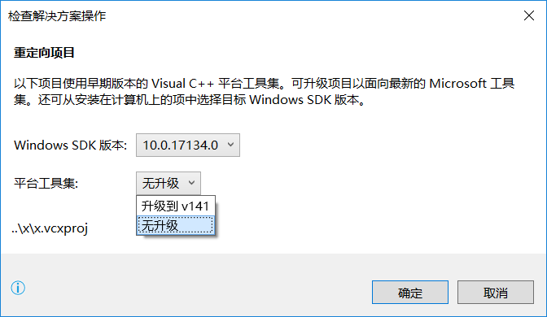
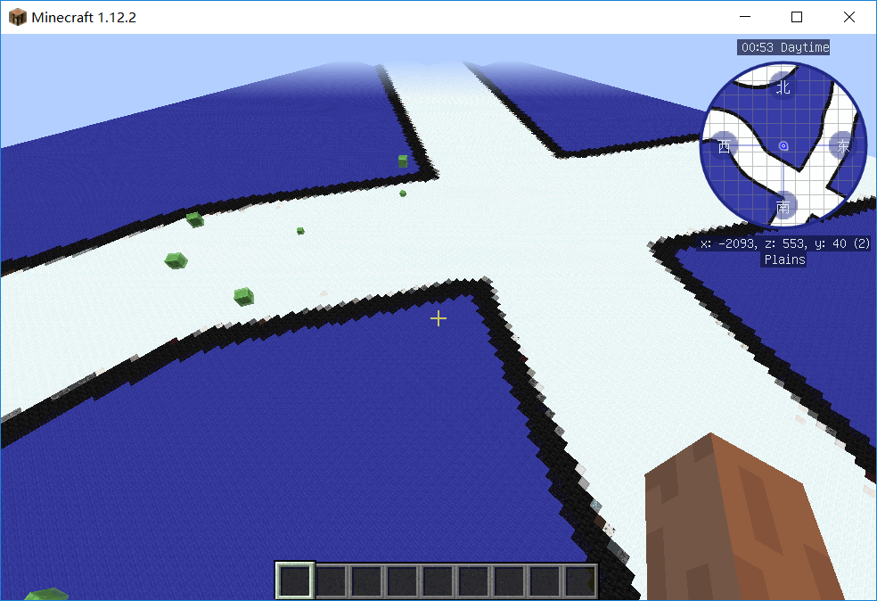
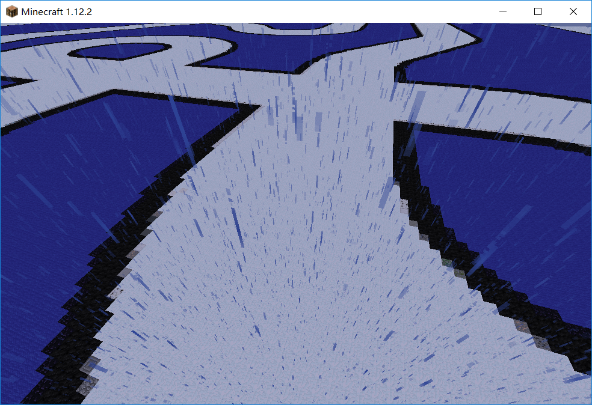
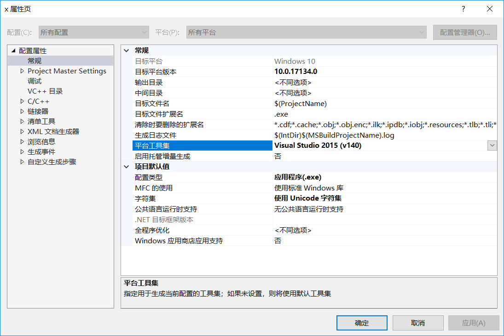
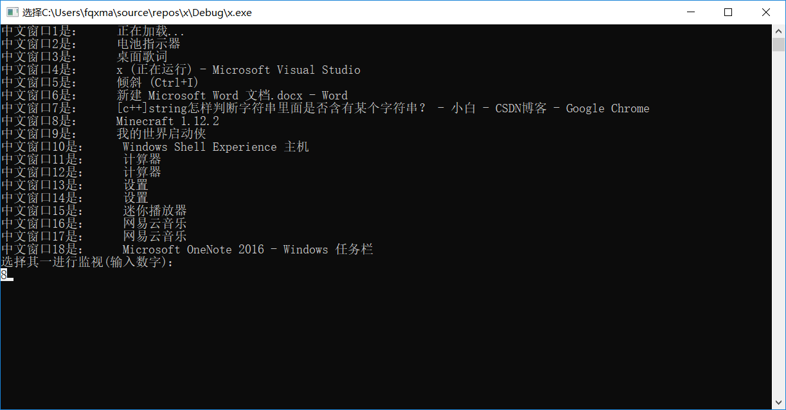
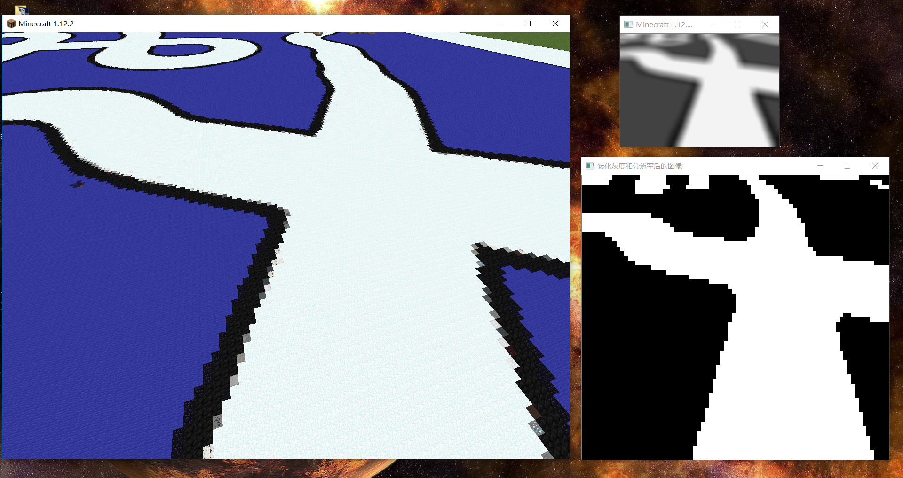
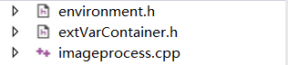

VisionSimulator
===============
A virtue platform to run image processing simulation for smartcar race.
智能车仿真图像生成平台。

### 零、效果演示

-   点击 [这里](http://v.youku.com/v_show/id_XMzg4NTgwMTc0NA==.html?spm=a2hzp.8244740.0.0 "Title") 查看

-   或者点击链接 http://v.youku.com/v_show/id_XMzg4NTgwMTc0NA==.html?spm=a2hzp.8244740.0.0

### 一、工程依赖：

-   vc14工具集

-   opencv.win.native nuget包

-   打开工程下图选择“无升级”

### 二、基于minecraft的图像虚拟平台

#### 2.1 Minecraft

建议使用版本1.12.2，建议下载方式：

-   Java版本：我的世界中文下载站（不过请支持正版\~）

-   网易mc中国版（免费正版）

-   Windows应用商店版本（付费）

安装后，打开我提供的example世界。如何制作世界请自行参考其他资料。

1.  使用独立显卡运行游戏！

2.  F1键隐藏手

3.  /gamemode 1 开启创造模式便于调整视角

4.  F3+P快捷键：是一个可以取消切出游戏换面时弹出的ESC游戏选项的功能，也就是说切出游戏不需要打开背包或者打开对话窗即可直接切出，单机玩家不会进入暂停界面。

5.  视频设置渲染距离远

6.  角视场自行调整

7.  双击空格离地

8.  空格上升

9.  shift下降。

10. /gamerule doMobSpawning false禁止生物出现

11. /weather rain 雪花噪点

12. F3查看当前坐标：所处高度，摄像头指向等

#### 2.2 VisionSimulator

##### 2.2.1 注意事项

使用Visual Studio 2017或Visual Studio
2015,为保证程序能够正确编译，请配置平台工具集为Visual Studio 2015（v140）。

否则nuget获得的opencv会出问题。

##### 2.2.2 开始

编译运行，程序检测所有windows窗体，选择其中的Minecraft窗体，如图：

##### 2.2.3 运行

将游戏界面拖到你能看到的位置，此时程序将会实时捕获游戏界面。

##### 2.2.4 裁剪

如果捕获的画面包含有标题栏等不希望出现的东西，按控制台上的提示按按键调整。

##### 2.2.5边界柔和以及二值化

使用下面的代码进行边界柔和以及二值化。

cvtColor(src_orig, src_gray, CV_BGR2GRAY);//灰度化

Mat src_cut = src_gray(Range(up_cut, src_gray.rows-1-down_cut), Range(left_cut,
src_gray.cols-1-right_cut));//裁剪

const int \_target_width = 80;//转化为80\*60的灰度图

const int \_target_hight = 60;//转化为80\*60的灰度图

int kenel_size_x = blur_parameter \* src_cut.rows / \_target_hight; if
(kenel_size_x % 2 == 0) kenel_size_x += 1;

int kenel_size_y = blur_parameter \* src_cut.cols / \_target_width; if
(kenel_size_y % 2 == 0) kenel_size_y += 1;

int kenel = (kenel_size_x \> kenel_size_y) ? kenel_size_x :
kenel_size_y;//取较大的当卷积核

blur(src_cut, src_blur, Size(kenel, kenel));//模糊图像以取得顺滑的边界线

scaleIntervalSampling(src_blur, target_img,

(double)_target_hight / (src_blur.rows),

(double)_target_width / (src_blur.cols));//转化为80\*60的灰度图

threshold(target_img, img_threshold, 0, 255, CV_THRESH_OTSU);//大津法二值化

##### 2.2.6 图像处理接口

-   三个文件负责处理图像：

-   测试的图像处理函数的内容

//下面几个头文件使得该文件（imageprocess）可以跨越单片机和电脑，复制粘贴后即可运行在单片机上

//请在单片机和电脑上编写不同的"environment.h"和"extVarContainer.h"

\#include \<stdint.h\>

\#include "environment.h" //指示了当前的环境

\#include "extVarContainer.h" //存放了单片机上一些不能转移的外部变量，例如extern
float speed;访问虚拟的车速

int imageProcessOnChipAndOnVS(uint8_t (\*img)[CAMERA_COLS])

{

for (int i = 10; i \< CAMERA_ROWS - 10; i++)//测试：在图像中画一条竖线

{

for (int j = 10; j \< CAMERA_COLS - 10; j++)

{

if (j == 40)

{

img[i][j] = 125;

}

}

}

return 0;

}

-   主程序中的图像处理函数接口：

if (src_blur.rows \> 0 && src_blur.rows \> 0) {

imshow(outputname, src_blur);//显示采集后模糊的图像

}

if (img_threshold.rows \> 0 && img_threshold.rows \> 0) {

imshow("转化灰度和分辨率后的图像", img_threshold);//显示…………的图像

}

for (int i = 0; i \< img_threshold.rows; i++) {//转入八位数组中待处理

for (int j = 0; j \< img_threshold.cols; j++) {

image_target[i][j] = img_threshold.at\<uint8_t\>(i, j);

}

}

/\*\*\*\*\*\*\*\*\*\*\*\*\*\*\*\*\*\*\*\*\*\*图像处理接口\*\*\*\*\*\*\*\*\*\*\*\*\*\*\*\*\*\*\*\*\*\*\*\*\*\*\*/

imageProcessOnChipAndOnVS(image_target);

/\*\*\*\*\*\*\*\*\*\*\*\*\*\*\*\*\*\*\*\*\*\*图像处理接口\*\*\*\*\*\*\*\*\*\*\*\*\*\*\*\*\*\*\*\*\*\*\*\*\*\*\*/

for (int i = 0; i \< img_result.rows; i++) {//处理完后装入Mat中，待显示

for (int j = 0; j \< img_result.cols; j++) {

img_result.at\<uint8_t\>(i, j)=image_target[i][j];

}

}

if (img_result.rows \> 0 && img_result.rows \> 0) {

imshow("处理后的图像", img_result);//显示结果

}

### 三、等你开发
